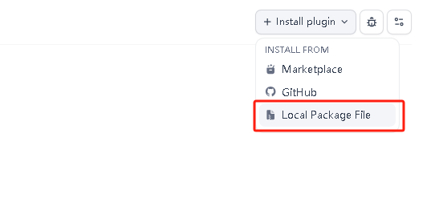

# dify_plugs

dify离线插件，用于服务器内网完全离线情况安装

### Installing Plugins via Local 通过本地安装插件
Visit the Dify platform's plugin management page, choose Local Package File to complete installation.

访问 Dify 平台的插件管理页，选择通过本地插件完成安装。

## 致谢
- [dify-插件重新打包](https://github.com/junjiem/dify-plugin-repackaging.git)
